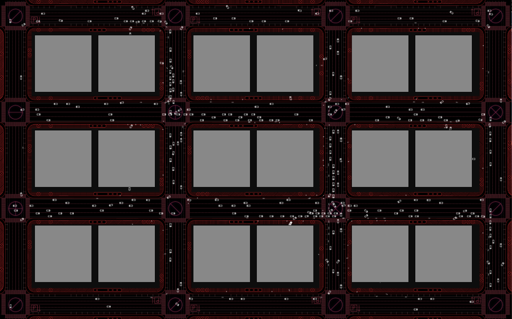
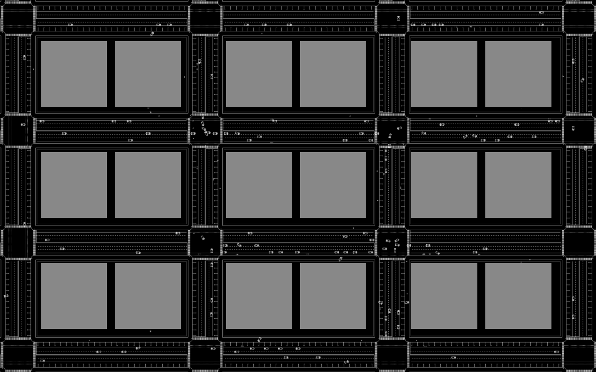
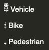

### Autonomous Vehicles as Moral Machines

This is an agent-based model (ABM) that simulates 2 alternative futures for our streets with autonomous vehicles (AVs).
The simulation demonstrates ideas for a paper written at the MIT Media Lab about how if AV driving algorithms are properly designed, they can be vehicles of change that drive forward more equitable streets.
[See Paper](https://docs.google.com/document/d/1BlcuKNUD1KOblP5JW6aEXMcnS0sMfL_g7d8P9sffAyA/edit?usp=sharing)

A view of 2 alternative future worlds with AVs in their streets:

(Red background) The first future world is where AVs operate similarly to the privately owned and operated vehicles of our present streets.

(White background) The second world is where AVs are programmed to operate as shared transit, as well as always yield to bikers and pedestrians.

The running simulation allows toggling between these two worlds.  In the first world, one can watch as the traffic of cars accumulates, as well as see how the vehicles do not always wait for pedestrians and bikers at intersections.
In the second world, the movements on the streets change.  The vehicles always yield to bikers and pedestrians.  More people choose to take shared transit, or bike or walk, and the congestion on the streets eases.
[Watch a recording of the running simulation](output-assets/simulation-toggled-between-worlds-mid-way.mp4) or run it yourself (see below).

# About

### Credit

This project is a fork of work done by the City Science team at MIT's Media Lab.  It originated as an interactive physical table + simulation for an [exhibition at the Cooper Hewitt Museum](https://www.media.mit.edu/events/media-lab-projects-at-the-cooper-hewitt/).

Much credit goes to:
*(in alphabetical order)*
Ariel Noyman, Arnaud Grignard, Carson Smuts, Gabriela Advincula, Guadalupe Fernandez, Kent Larson, Luis Alberto Alonso Pastor, Maitane Iruretagoyena, Margaret Church, Markus ElKatsha, Ronan Doorley, Yan Zhang, Yasushi Sakai

See https://github.com/CityScope/CS_Cooper-Hewitt

# About AVs and our Future Streets

Our future streets will be driven by autonomous vehicles (AVs), and the introduction of AVs presents an opportunity to update how our streets are used.  What societal values should be embedded in the algorithms that drive them?  If properly designed, programmed, and governed, AVs can improve public health, mobility and morality on our future streets.

This is a simulation of two potential futures for autonomous vehicles (AVs):

__1. private__

A world where the streets and their vehicles operate as they do today.  Vehicles are privately owned consumer goods, driven to maximize safety and efficiency for their own passengers.

__2. shared__

A world where AVs operate as shared transit.  They are programmed with new priorities for the streets and their driving algorithms are optimized to maximize public well being.  They always yield to pedestrians and bikers and other vehicles that carry more passengers.  Due to this behavior, __there is an increase in__:

- __road safety__: yielding to higher occupancy vehicles and more vulnerable commuters (bikers and pedestrians) lowers the risk of harm to a greater number of people

- __incentives to bike or walk or use shared transit__: when commutes become safer and more efficient for bikers, walkers, and shared transit, commuters are more likely to choose those modes of transit over private vehicles

- __environmental sustainability__: fewer private vehicles on the road means less pollution

# Agent-based Model for this Simulation of Streets

City streets can be viewed as autonomous systems.  At any given time, there are countless independent, asynchronous decisions being made by the people that move upon them.  These independent decisions aggregate into predictable mobility patterns on the streets with a variety of determining factors: the topology of streets and the rules that govern them, commuting patterns, incentives to take public transit vs private car vs walk, and other mechanisms that determine individual behaviors.

This simulation of streets uses an agent-based model.  [An agent-based model (ABM) is a class of computational models for simulating the actions and interactions of autonomous agents with a view to assessing their effects on the system as a whole.](https://en.wikipedia.org/wiki/Agent-based_model).  In this simulation, each car/bike/pedestrian is the visualization of a (human) agent's behavior within the model.
The simulation uses data from the 2018 National Household Survey (NHTS) responses.  This data* is used to derive a synthetic population (used as the agents), as well as a decision tree that determines the mobility choices (car/bike/walk/shared transit) for the agents in the model.

For data science details and implementation, see: https://github.com/CityScope/CS_activityBased
*The subset of data used is for people living in the New York + Newark areas (CBSA 35620).

### Agents

The model's agents are assigned attributes from the NHTS survey responses, such as household income, age, occupation, etc.  They are also assigned locations for the residences, offices, and the amenities they go to.

### Mobility Choices

Agents in the model take trips within the simulated city.  They travel to and from their residences, offices, and amenities, and they make realtime mobility decisions for each trip they take: whether to travel by __private car__ vs __bike__ vs __walk__ vs __shared transit__.
These decisions are determined by the decision tree model derived from the NHTS data.  The decision tree uses the agents' personal attributes from the data and the distance they are traveling.  The decision is also based on whether they are in the __(1) private__ vs __(2) shared__ world.

#### Traveling in the Private vs Shared Future Worlds

Throughout their trips, agents update how they choose to move on the streets.  Cars, bikes, and pedestrians move differently in the world of private AVs vs shared AVs.

The world of private AVs more closely represents current streets and the rules and values driving them: Vehicles carefully avoid collisions, they yield to other vehicles at intersections, but do not go out of their way to yield to bikes or pedestrians.  

In the world where AVs are designed to operate as shared transit, AV driving algorithms behave differently.  For example, they yield to bikes and pedestrians rather than making bikers and pedestrians wait for them to pass.

The different algorithms for private vs shared AVs leads to differing behaviors on the simulated streets.
In the __shared__ world:
- Agents take shared vehicles instead of private cars.
- Traveling by bike or on foot is more efficient (and safer) because vehicles yield to them.  Thus more agents choose to travel by bike or foot.

The resulting change in congestion and mobility on the streets can be viewed in the simulation.

### Visualization

The simulation displays a generic city grid, and the movements of agents between city blocks as they travel between their residences, offices, and amenities.

The blocks are gray.  A red background indicates when (1) the private world is simulated;  a white background indicates when (2) the shared world is simulated.

#### Mobility Type Icons

## Run Code

The simulation is implemented with [Processing](https://processing.org/).  Running the code requires downloading Processing and installing the libraries that the project imports which include [pathfinder](http://www.robotacid.com/PBeta/AILibrary/Pathfinder/index.html)

Download/clone repository and `cd` into it.

`source run.sh`

### Options

Once running, the following can be toggled

key | effect
--- | ---
p | pause
w | toggle between worlds: private vs shared AVs
*space* | hide/show background
n | hide/show networks for AVs/bikes/pedestrians
m | hide/show color coded mobility types
b | hide/show buildings
z | hide/show debug color for agents that move on/off grid
u | hide/show collision detection buffers
